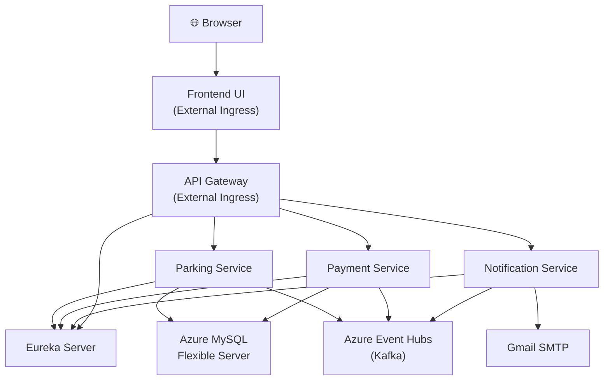

# Azure Deployment Walkthrough — Parking Lot Management System

## 🎉 Deployment Complete!

Your entire Parking Lot Management microservice ecosystem is now live on **Azure Container Apps**, including your newly containerized Frontend!

## Public Endpoints

> [!IMPORTANT]
> **Use the Frontend URL below to access the fully functional web application in your browser!**

🌐 **Frontend UI**: `https://frontend-ui.graybay-55cd72d8.eastus.azurecontainerapps.io`
🌐 **API Gateway**: `https://api-gateway.graybay-55cd72d8.eastus.azurecontainerapps.io`

The frontend has been updated with dynamic routing. It automatically routes traffic to the API Gateway using the secure cloud URL.

---

## Azure Resources Created

| Resource | Type | Details |
|---|---|---|
| `ParkingResourceGroup` | Resource Group | East US |
| `parkingregistrysonu2026` | Container Registry (ACR) | Basic SKU, admin enabled |
| `parkingmysqlsonu` | MySQL Flexible Server | West US 2, Standard_B1ms, MySQL 8.0.21 |
| `parkingeventhubs2026` | Event Hubs Namespace | East US, Standard SKU, Kafka-enabled |
| `parking-env` | Container Apps Environment | East US, Consumption workload profile |

## Deployed Container Apps

| Service | Status | Ingress | FQDN |
|---|---|---|---|
| `eureka-server` | ✅ Running | Internal | `eureka-server.internal.graybay-55cd72d8.eastus.azurecontainerapps.io` |
| `parking-service` | ✅ Running | Internal | `parking-service.internal.graybay-55cd72d8.eastus.azurecontainerapps.io` |
| `payment-service` | ✅ Running | Internal | `payment-service.internal.graybay-55cd72d8.eastus.azurecontainerapps.io` |
| `notification-service` | ✅ Running | Internal | `notification-service.internal.graybay-55cd72d8.eastus.azurecontainerapps.io` |
| `api-gateway` | ✅ Running | **External** | `api-gateway.graybay-55cd72d8.eastus.azurecontainerapps.io` |
| `frontend-ui` | ✅ Running | **External** | `frontend-ui.graybay-55cd72d8.eastus.azurecontainerapps.io` |

## Event Hubs (Kafka Topics)

| Topic | Partitions |
|---|---|
| `ticket-generated-topic` | 2 |
| `payment-completed-topic` | 2 |

## Database

- **Host**: `parkingmysqlsonu.mysql.database.azure.com`
- **Database**: `ParkingLotManagementSystem`
- **Username**: `rootuser`
- **Password**: `ParkingSecret2026!`

## Architecture Diagram



## Cost Estimate (Monthly)

| Resource | Estimated Cost |
|---|---|
| Container Apps (6 × 0.5 vCPU, 1GB) | ~$60-90 |
| MySQL Flexible Server (B1ms) | ~$15 |
| Event Hubs (Standard, 1 TU) | ~$22 |
| Container Registry (Basic) | ~$5 |
| **Total** | **~$102-132/month** |

Well within your $400/month budget!

## Cleanup (When Needed)

To delete all Azure resources and stop billing:
```bash
az group delete --name ParkingResourceGroup --yes --no-wait
```
